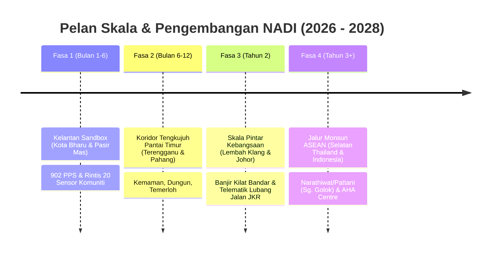

# NADI — Master Pitch Defense & Mentoring Action Playbook
**Panduan Strategik Menghadapi Sesi Penjurian & Mentoring Berdasarkan Maklum Balas Sebenar**

---

## 1. Ringkasan Eksekutif Maklum Balas Mentor & Matlamat Utama

Mentor telah memberikan 8 maklum balas paling bernilai untuk memenangi pertandingan ini:
1. **Validation (Paling Kritikal)**: Juri mahu bukti nombor sebenar, bukan sekadar teori.
2. **Future Scale**: Pelan pengembangan dari Kelantan ke peringkat kebangsaan & serantau.
3. **Background Putih**: Tampilan korporat/kerajaan yang bersih (GovTech standard), bukan estetika gelap *gamer/hacker*.
4. **Where to Install**: Kejelasan cara pengguna memasang aplikasi (PWA) DAN di mana kerajaan memasang sensor fizikal.
5. **Why Different**: Matriks perbezaan mutlak berbanding SISPAA, MyJalan, InfoBanjir, dan Waze.
6. **B2B / Business Value**: Nilai ringgit & sen yang spesifik untuk peniaga tempatan (kedai runcit, bengkel, kafe).
7. **Government Appeal**: Bagaimana NADI menjimatkan bajet kerajaan, mengurangkan beban pegawai, dan menyelaraskan dasar MADANI / NADMA.
8. **Be Less Technical**: Tukar istilah teknikal rumit kepada impak praktikal menyelamatkan nyawa dan wang.

---

## 2. Validation (Validasi Sebenar NADI — Bukti Di Atas Kertas & Lapangan)

### A. Validasi Masalah (Problem Validation)
* **Banjir Tahunan Pantai Timur**:
  - Musim tengkujuh 2023/2024 merekodkan lebih **900 PPS** dibuka di Kelantan dengan puluhan ribu mangsa dipindahkan.
  - Kerugian banjir di Malaysia mencecah **RM1 bilion hingga RM1.4 bilion** setahun (Jabatan Perangkaan Malaysia / DOSM).
* **Kelemahan Sensor Konvensional JPS**:
  - Satu stesen telemetri hidrologi JPS berharga **RM50,000 – RM100,000+**. Akibat kos yang tinggi, stesen ini hanya dipasang di sungai utama (Sungai Kelantan, Sungai Golok).
  - Sungai anak kampung, longkang monsun perumahan, dan parit pertanian tiada pemantauan — sedangkan 80% banjir kilat bermula di sini.
* **Aduan Terbiar (Civic Neglect)**:
  - Saluran aduan sedia ada (WhatsApp PBT, borang web) mengambil masa **14 hingga 30 hari** untuk diteliti kerana ketiadaan koordinat tepat dan penapisan aduan palsu.

### B. Validasi Penyelesaian & Data NADI (Solution Validation)
* **902 PPS Sah (Verified Geocoded Data)**:
  - NADI bukan menggunakan data rekaan (*mock data*). NADI telah memetakan **tepat 902 Pusat Pemindahan Sementara (PPS)** merentasi 10 jajahan Kelantan (Kota Bharu: 87, Pasir Mas: 105, Tumpat: 44, Kuala Krai: 191, dsb.) lengkap dengan koordinat GPS dan kapasiti.
* **Prototaip Penderia Bawah RM120 (Hardware Bench Test)**:
  - Sensor ultrasonik berkuasa solar (ESP32) diuji membaca aras air dengan ketepatan sentimeter dan kadar kenaikan (*rise rate* cm/jam).
  - Kos komponen: **~RM113 sebuah**, membolehkan komuniti memasang 100 nod pada harga satu stesen komersial.
* **Ujian Loghat Tempatan (Dialect NLP Validation)**:
  - Diuji dengan perkataan loghat Pantai Timur (*bekeng, ayor menaik, pokok rebah, hungga, deghas*) untuk membuktikan warga emas di kampung boleh membuat aduan suara tanpa halangan celik IT.

---

## 3. Future Scale (Skala & Pelan Pengembangan Masa Depan)

1. **Fasa 1: Kelantan Proof-of-Concept (Kini)**
   - Fokus kepada lembangan Sungai Kelantan (Jambatan Sultan Yahya Petra) dan Sungai Golok.
   - Pendaftaran 50 peniaga mikro tempatan dan 902 PPS aktif.
2. **Fasa 2: Koridor Pantai Timur (Bulan 6 – 12)**
   - Pengembangan ke Terengganu (Kemaman, Dungun) dan Pahang (Temerloh, Kuantan) yang mempunyai corak geografi dan monsun serupa.
3. **Fasa 3: Peringkat Kebangsaan (Tahun 2)**
   - Aplikasi sistem pengesanan lubang jalan automatik (*pothole telematics*) dan aduan infrastruktur di kawasan bandar (Kuala Lumpur, Selangor, Johor) bekerjasama dengan JKR dan Lembaga Lebuhraya Malaysia (LLM).
4. **Fasa 4: Jalur Monsun ASEAN (Tahun 3+)**
   - Sungai Golok berkongsi sempadan dengan Narathiwat (Selatan Thailand). Model LoRaWAN berdaya tahan tanpa talian selular ini boleh dieksport ke negara jiran melalui rangka kerja *AHA Centre (ASEAN Coordinating Centre for Humanitarian Assistance)*.

---

## 4. Background Putih (Estetika & Reka Bentuk Institusi)

* **Kenapa Mentor Meminta "Background Putih"?**
  - Panel penilai pertandingan inovasi kerajaan dan universiti majoritinya terdiri daripada dekan, pegawai kanan kementerian (KPT, MOSTI, NADMA), dan pelabur impak sosial.
  - Mod gelap (*dark mode*) kelihatan seperti konsol permainan video (*gaming/cyberpunk*) yang mengurangkan rasa kredibiliti rasmi.
  - Mod putih/cerah (*clean light theme*) memancarkan ketelusan, profesionalisme, kebersihan, dan sepadan dengan piawaian reka bentuk aplikasi kerajaan moden (*GovTech*, MySejahtera, gov.uk).
* **Tindakan Yang Telah Dibuat Dalam Kod**:
  - Konfigurasi tema utama dalam `src/context/ThemeContext.tsx` telah diubah secara lalai kepada **Mod Cerah (`light`)**.
  - Warna asas menggunakan `#FAFAF8` dengan kad `#FFFFFF`, teks `#1A1A1A`, dan sempadan halus `#E5E4E0` yang mesra pembacaan di bawah cahaya lampu dewan pembentangan.
  - Mod gelap kekal wujud sebagai pilihan kebolehcapaian (*accessibility toggle*) bagi pengguna yang menginginkannya.

---

## 5. Di Mana & Bagaimana Pasang Aplikasi & Sensor? ("Where to Install")

### A. Untuk Rakyat / Pengguna: Cara Memasang Aplikasi
* **Bukan Aplikasi Berat 100MB di App Store**:
  - NADI dibangunkan sebagai **Progressive Web App (PWA)** bertaraf *offline-first*.
  - Pengguna tidak perlu membuka Google Play Store, memuat turun fail APK yang besar, atau mendaftar akaun yang rumit.
* **Pemasangan 1-Sentuhan (Zero Friction)**:
  - Pengguna hanya mengimbas **Kod QR NADI** yang ditampal di:
    1. Pintu masuk 902 Pusat Pemindahan Sementara (PPS).
    2. Papan kenyataan Balai Penghulu, Masjid Mukim, dan Balai Bomba.
    3. Kedai kopi dan kedai runcit tempatan.
  - Pop-up *"Tambah ke Skrin Utama"* (Add to Home Screen) muncul serta-merta. Ia berfungsi seperti aplikasi biasa di Android dan iPhone, malah boleh dibuka tanpa internet selepas disimpan dalam cache.

### B. Untuk PBT / Kerajaan: Di Mana Sensor Fizikal Dipasang?
* **3 Titik Lokasi Pemasangan Strategik**:
  1. **Keleher Botol Sungai (River Bottlenecks & Bridges)**:
     - Dipasang di bawah jambatan utama (contoh: Jambatan Sultan Yahya Petra, Jambatan Tendong) untuk memantau paras air sungai utama.
  2. **Longkang Monsun & Pembetung Perumahan Rendah (Culverts & Storm Drains)**:
     - Dipasang di parit besar berhampiran taman perumahan berkepadatan tinggi (contoh: Lembah Sireh, Pasir Mas) untuk mengesan limpahan air sebelum memasuki rumah penduduk.
  3. **Hulu Sungai (Upstream Early Warning)**:
     - Dipasang di cabang sungai hulu (Kuala Krai / Gua Musang) untuk memberi **amaran awal 3 hingga 6 jam** sebelum kepala air atau gelombang banjir tiba di Kota Bharu.
* **Kaedah Pemasangan Mudah (Non-Invasive Clamp Mounting)**:
  - Menggunakan pendakap pengapit keluli tahan karat (*stainless steel clamp*) pada palang jambatan atau bibir pembetung.
  - **Tiada kerja korek jalan, tiada pendawaian TNB** — dikuasakan oleh panel solar mini 5W dan bateri LiFePO4 tahan cuaca ekstrem.
  - Pemasangan mengambil masa hanya **20 minit setiap unit**.

---

## 6. Mengapa NADI Berbeza Daripada Yang Lain? (Matriks Perbezaan)

| Ciri Utama | **NADI** | **SISPAA / MyJalan** | **InfoBanjir (JPS)** | **Waze / Google Maps** |
| :--- | :--- | :--- | :--- | :--- |
| **Kitaran Guna 365 Hari** | **Ya** (Bencana waktu banjir; Kerja, Komuniti & Peniaga waktu biasa) | Aduan semata-mata (borang birokrasi) | Hanya tengok paras air waktu hujan | Navigasi jalan raya sahaja |
| **Kos Pemantauan Saliran** | **RM113 / sensor** (Jaring sensor mikro di longkang kampung) | Tiada (bergantung laporan manusia) | **RM50k - RM100k+** setiap stesen telemetri | Tiada sensor fizikal |
| **Berfungsi Waktu Talian Padam** | **Ya** (Jaringan LoRaWAN 3-5km & PWA offline cache) | Tidak (perlukan 4G/5G) | Tidak (stesen guna modem selular/satelit) | Tidak (peta gagal memuat) |
| **Akses Loghat Tempatan** | **Ya** (Aduan suara loghat Kelantan, Tamil, Mandarin, BM) | Tidak (Borang teks BM formal) | Tidak | Tidak |
| **Navigasi 902 PPS Sah** | **Ya** (Kapasiti semasa, laluan selamat elak banjir) | Tiada | Senarai pasif / Buletin PDF | Pin lokasi rawak / tidak disahkan |
| **Ekonomi Komuniti Setempat** | **Ya** (Padanan kerja sifar caj, B2B pemborong & peniaga) | Tiada | Tiada | Iklan komersial korporat |

> **Jawapan Maut Kepada Juri:**
> *"SISPAA dan InfoBanjir hanya berfungsi secara satu hala. Waze pula untuk pemandu kereta. NADI adalah **Sistem Operasi Sivik & Bencana 365 hari** — rakyat menggunakan NADI setiap hari untuk cari rezeki dan aduan jalan, dan apabila banjir melanda, mereka sudah sedia berada di platform yang sama tanpa perlu muat turun aplikasi baharu di saat kecemasan."*

---

## 7. B2B / Nilai Perniagaan: Bagaimana NADI Membantu Peniaga Tempatan?

### A. 4 Masalah Pokok Peniaga Tempatan di Kelantan
1. **Kerugian Stok Banjir Mengejut (RM10,000 – RM50,000)**: Air naik waktu tengah malam ketika kedai tutup; peniaga tidak sempat memindahkan barang runcit, perkakas elektrik, atau guni beras.
2. **Krisis Pekerja "Ghosting"**: Peniaga bengkel dan kafe menggaji pekerja yang tinggal jauh; selepas 3 hari pekerja tidak datang kerana masalah pengangkutan.
3. **Kos Pengiklanan Terbuang**: Peniaga mikro membayar RM300–RM500 untuk Facebook/TikTok ads tetapi audiens yang melihat berada di luar jajahan.
4. **Kenaikan Kos Bahan Mentah**: Kedai makan membeli barang basah melalui orang tengah (*middlemen*) dengan margin keuntungan yang tertekan.

### B. Penyelesaian B2B Nyata NADI
1. **Amaran Awal Stok Perniagaan (B2B Flood Warning)**:
   - Apabila sensor NADI di hulu mengesan kenaikan mendadak (*rise rate* > 10 cm/jam), sistem menghantar amaran khusus kepada peniaga di kawasan rendah:
   - *"Peniaga Zon Lembah Sireh: Paras air dijangka melimpah dalam tempoh 2.5 jam. Sila pindahkan stok inventori ke rak tinggi sekarang."*
   - Menyelamatkan purata RM15,000 kerugian inventori setiap premis.
2. **Pengambilan Pekerja Tanpa Ghosting (Radius 5km Hyper-Local Pool)**:
   - Peniaga boleh menyiarkan iklan kerja khusus kepada penduduk dalam radius 5km dari kedai.
   - Pekerja tinggal berdekatan kedai, menyelesaikan isu ketiadaan kenderaan dan kelewatan.
3. **Membuka Subsidi Gaji Kerajaan (PERKESO KerjayaMADANI)**:
   - Ramai peniaga kecil tidak tahu kerajaan menyediakan subsidi gaji RM600–RM1,000 sebulan selama 6 bulan untuk belia rentan.
   - NADI mengandungi **Kalkulator Subsidi Gaji**: Peniaga tawar gaji RM1,800, kos bersih kedai hanyalah RM1,000/bulan! Borang permohonan dijana secara automatik.
4. **Papan Bekalan Borong Nadi-Niaga (B2B Wholesale Board)**:
   - Menghubungkan peladang sayur dan nelayan terus kepada pengusaha kedai makan tempatan, memotong komisen orang tengah sebanyak 15% – 25%.
5. **Model Pendapatan Komersial NADI (B2B Monetization)**:
   - **Percuma** untuk peniaga mikro biasa.
   - **Langganan NADI Niaga Pro (RM29/bulan)**: Mendapat keutamaan paparan di direktori tempatan, laporan analisis risiko banjir premis bagi tujuan diskaun insurans, dan notifikasi SMS amaran awal inventori.

---

## 8. Government Appeal: Bagaimana Menarik Minat Kerajaan (PBT, JPS, JKR, NADMA)?

### 1. Penjimatan Bajet Pembelian Sensor (Cost Avoidance)
* Satu stesen hidrologi JPS: **RM80,000**.
* Jaring 100 sensor NADI: **RM11,300**.
* **Nilai kepada Kerajaan**: PBT atau JPS boleh memantau 100 parit kampung dengan hanya menggunakan 15% daripada kos membeli satu stesen tradisional.

### 2. Mengurangkan Kos Operasi Menyelamat (APM & Bomba)
* Kos mengerahkan sebuah bot penyelamat APM bersama 4 anggota: **~RM500 – RM1,000 setiap operasi**.
* Sering berlaku bot dihantar ke lokasi yang sebenarnya boleh dilalui lori atau aduan palsu di media sosial.
* NADI menyediakan pengesahan geospatial dan foto berkoordinat tepat, menghalang pembaziran aset penyelamat.

### 3. Mengurangkan Beban Kerja Pegawai PBT (Automated AI Triage)
* Pegawai majlis daerah menerima ribuan mesej WhatsApp aduan yang bertindih dan tidak tersusun.
* Enjin NADI secara automatik:
  - Mengasingkan jenis kerosakan (Jalan $\rightarrow$ JKR; Longkang tersumbat $\rightarrow$ PBT; Tempat pembiakan Aedes $\rightarrow$ Pejabat Kesihatan Daerah).
  - Menyingkirkan aduan bertindih (*deduplication*) jika 10 pengguna melaporkan lubang yang sama di Jalan Sultan Yahya Petra.

### 4. Menepati Dasar Nasional (Policy Alignment)
* Selaras dengan aspirasi **Malaysia MADANI** (Teras Daya Cipta & Ihsan).
* Selaras dengan **Dasar Pengurangan Risiko Bencana Negara (DRR 2030)** di bawah NADMA.
* Menyokong **Inisiatif Bandar Pintar Malaysia (MSCF)** di bawah Kementerian Perumahan dan Kerajaan Tempatan (KPKT).

---

## 9. Be Less Technical: Panduan Pertuturan & Skrip Praktikal

Gunakan formula: **Siapa yang susah? $\rightarrow$ Apa NADI buat dalam 5 saat? $\rightarrow$ Apa nyawa/wang yang diselamatkan?**

### Jadual Terjemahan Istilah Teknikal Kepada Impak Praktikal

| JANGAN CAKAP (Terlalu Teknikal) ❌ | CAKAP YANG INI (Praktikal & Berimpak) ✅ |
| :--- | :--- |
| "Kami bina algoritma penapisan EWMA dan Median pada ESP32 untuk singkirkan hingar ADC sonar..." | *"Air sungai bergelora dan berombak boleh cetuskan penggera palsu. Sensor kami ada penapis automatik supaya penduduk tak panik tengah malam kerana bacaan palsu — hanya amaran banjir sebenar yang dihantar."* |
| "Kami laksanakan inferens Llama 3.3 melalui Groq untuk mentranskripsi fonem loghat Pantai Timur..." | *"Warga emas di kampung tak pandai isi borang online birokrasi. Dengan NADI, makcik cuma tekan satu butang dan cakap dalam loghat Kelantan: 'Air naik tinggi lutut dah tepi surau', sistem terus faham dan letak pin bantuan kecemasan."* |
| "Sistem kami menggunakan protokol LoRaWAN modulasi Chirp Spread Spectrum frekuensi AS923 923MHz..." | *"Waktu ribut petir melanda, pencawang telco dan elektrik sering terputus. NADI guna gelombang radio jarak jauh yang boleh hantar isyarat sehingga 3 kilometer tanpa perlukan kad SIM, talian 4G, atau internet."* |
| "Kami jalankan PostGIS spatial spatial-clustering ST_DWithin 15 meter untuk mengelakkan *redundancy*..." | *"Kalau 20 pemandu langgar lubang jalan yang sama, pegawai JKR tak perlu baca 20 aduan berasingan. NADI gabungkan semua laporan itu menjadi satu tiket tindakan rasmi dengan gambar dan lokasi tepat."* |

---

## 10. Skrip Pembentangan 2 Minit (The Winning 2-Minute Pitch)

> **[Slide 1: Masalah Manusia — Bukan Slaid Kod]**  
> *"Assalamualaikum dan selamat sejahtera. Saban tahun, apabila musim tengkujuh tiba di Kelantan, senarionya sentiasa berulang: penduduk panik di tengah malam kerana air naik mendadak tanpa amaran, pusat pemindahan sesak, dan peniaga kecil menanggung kerugian puluhan ribu ringgit akibat stok barang yang musnah ditenggelami banjir.*  
> *Tetapi bila banjir surut, masalah rakyat tidak habis. Jalan berlubang maut dan longkang tersumbat menunggu berminggu-minggu untuk dibaiki.*
>
> **[Slide 2: NADI — Sistem Operasi Sivik 365 Hari]**  
> *Memperkenalkan NADI — Sistem Operasi Sivik dan Bencana Pintar Kelantan yang hidup 365 hari setahun.*  
> *Pada hari biasa, NADI adalah nadi komuniti — rakyat melaporkan kerosakan infrastruktur secara suara dalam loghat tempatan, dan anak muda mencari kerja dekat dengan rumah di kalangan peniaga tempatan tanpa caj orang tengah.*  
> *Tetapi apabila musim tengkujuh tiba, NADI bertukar menjadi jaring pertahanan banjir.*
>
> **[Slide 3: Praktikal & Realiti Lapangan]**  
> *Bukan sekadar aplikasi di atas kertas, NADI telah memetakan **tepat 902 Pusat Pemindahan Sementara (PPS)** sah di seluruh Kelantan. Dan untuk menyelesaikan masalah stesen pemantau banjir yang terlalu mahal, kami membangunkan sensor paras air berkuasa solar berharga hanya **RM113 sebuah**. Ia menghantar amaran awal melalui gelombang radio LoRa walaupun talian telefon dan elektrik terputus sepenuhnya.*
>
> **[Slide 4: Menang Bersama Perniagaan & Kerajaan]**  
> *Kepada peniaga, NADI memberi amaran awal 2 jam untuk menyelamatkan inventori kedai dan memadankan subsidi gaji kerajaan PERKESO sehingga RM1,000 sebulan.*  
> *Kepada kerajaan, NADI menjimatkan berjuta-juta ringgit kos pemasangan sensor dan membantu bilik gerakan bencana menyelamatkan nyawa dengan lebih pantas.*
>
> *NADI bukan sekadar teknologi pintar — NADI adalah denyut nadi keselamatan dan ekonomi rakyat Kelantan. Sekian, terima kasih."*

---

## 11. Senarai Soalan Cepumas Juri & Skrip Jawapan Pantas

#### Soalan 1: "Kenapa tak guna Waze atau Facebook saja?"
> **Jawapan:**  
> *"Waze hanya untuk jalan raya dan pemandu kereta, manakala Facebook penuh dengan khabar angin yang tidak ditapis. NADI adalah platform berstruktur yang memetakan 902 PPS rasmi, paras air sensor sebenar, dan menyalurkan aduan terus ke meja PBT. Paling penting, Waze dan Facebook lumpuh apabila pencawang 4G terputus elektrik, sedangkan NADI mempunyai rangkaian radio sandaran LoRa."*

#### Soalan 2: "Kerajaan dah ada SISPAA dan InfoBanjir JPS. Kenapa nak buat yang baru?"
> **Jawapan:**  
> *"InfoBanjir JPS sangat bagus untuk sungai besar, tetapi stesennya berharga RM80,000 setiap satu dan tidak memantau parit kampung. NADI melengkapkan (complement), bukan menggantikan JPS — kami menyediakan penderia komuniti mikro RM113 untuk memantau longkang monsun. SISPAA pula hanya borang aduan rasmi satu hala, manakala NADI adalah platform dua hala yang hidup sepanjang tahun dengan aktiviti komuniti harian."*

#### Soalan 3: "Siapa yang akan bayar kos selenggara sensor RM113 ini?"
> **Jawapan:**  
> *"Sensor kami direka dengan 'solid-state' ultrasonik tanpa komponen bergerak dan dikuasakan oleh bateri solar LiFePO4 yang tahan 3–5 tahun. Kos penggantian sebuah unit hanyalah sekitar RM110, yang boleh ditanggung melalui peruntukan komuniti KRT/JAS atau tajaan CSR syarikat korporat tempatan yang mendapat lencana penaja prihatin dalam aplikasi."*

#### Soalan 4: "Macam mana nak pastikan orang tak buat aduan palsu?"
> **Jawapan:**  
> *"NADI menggunakan enjin 'Multi-Citizen Spatial Verification'. Aduan jalan berlubang atau banjir kilat hanya ditandakan sebagai disahkan sekiranya sekurang-kurangnya 3 pengguna berasingan melaporkannya pada koordinat GPS yang sama dalam lingkungan 15 meter. Kami juga merekodkan tandatangan peranti bagi menghalang cubaan bot atau spam."*
